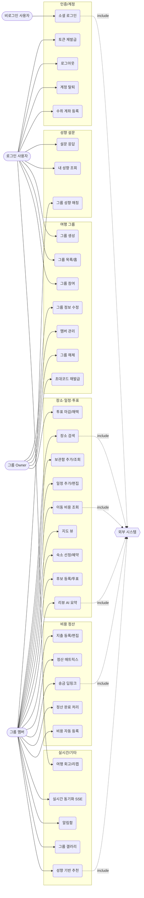

# Use-Case 다이어그램

**프로젝트명** 그룹 여행 협업 플랫폼 (enjoy-trip)

---

## 1. 액터 정의

| 액터 | 설명 |
| --- | --- |
| **비로그인 사용자** | 소셜 로그인 전 방문자 |
| **로그인 사용자** | OAuth 로그인 완료. 그룹 생성/참여, 설문, 마이페이지 |
| **그룹 멤버** | 특정 그룹에 속한 사용자. 장소·일정·투표·지출 협업 |
| **그룹 Owner** | 그룹 멤버 ⊂ 권한. 그룹 수정/해체/멤버 관리 |
| **시스템(스케줄러/배치)** | 그룹 상태 자동 전환, 캐시 만료 |
| **외부 시스템** | Google Places · 카카오 모빌리티 · TourAPI · Gemini · 토스/카카오페이 · Google/Kakao OAuth |

> Owner는 멤버를, 멤버는 로그인 사용자를 일반화(상속)한다.

---

## 2. 전체 Use-Case 다이어그램

---

## 3. 주요 Use-Case 명세 (대표 3종)

### UC1 — 소셜 로그인

| 항목 | 내용 |
| --- | --- |
| 액터 | 비로그인 사용자, Google/Kakao OAuth |
| 사전조건 | 미인증 상태 |
| 기본흐름 | ① 로그인 버튼 → ② OAuth 제공자 인증 → ③ 백엔드 콜백이 1회용 코드 발급·프론트 `/oauth/callback` 리다이렉트 → ④ 프론트가 코드 교환(`/api/auth/oauth/exchange`) → ⑤ Access(메모리)+Refresh(HttpOnly 쿠키) 발급 |
| 예외 | 인증 실패 시 `oauth_failed`로 콜백 |
| 사후조건 | 신규면 사용자/식별자 생성, 홈 진입 |

### UC32 — 일정 추가 (협업)

| 항목 | 내용 |
| --- | --- |
| 액터 | 그룹 멤버 |
| 사전조건 | 그룹 멤버, 여행 기간 내 일자 |
| 기본흐름 | ① 일자/시간/장소(보관함·검색·빈 일정) 입력 → ② 검증(시작<종료, 기간 내) → ③ 저장(order_index) → ④ `SCHEDULE_ADDED` 발행 → ⑤ 타 멤버 화면 실시간 갱신 |
| 대안흐름 | 장소 미정 시 빈 일정 생성 후 투표(UC36)로 결정 |
| 사후조건 | 일정 목록·지도에 반영 |

### UC44 — 이동/숙박 비용 자동 등록

| 항목 | 내용 |
| --- | --- |
| 액터 | 그룹 멤버 |
| 사전조건 | 일정에 예상비용 또는 이동수단 존재 |
| 기본흐름 | ① "정산에 추가" → ② 결제자 지정 → ③ 카테고리 TRANSPORT/LODGING + 균등분담 + `sourceScheduleId`로 멱등 등록 → ④ 정산 매트릭스 재계산 |
| 규칙 | 같은 `sourceScheduleId`는 중복 등록되지 않음(멱등) |
