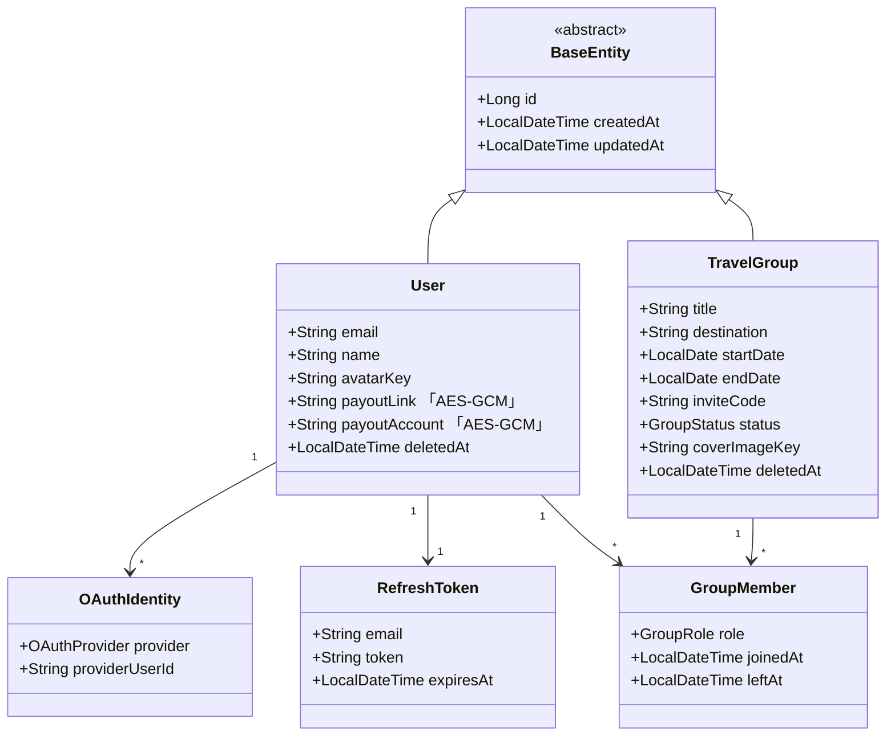
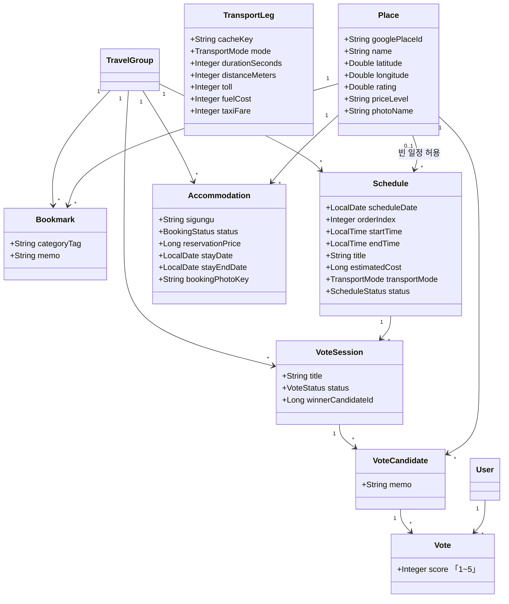
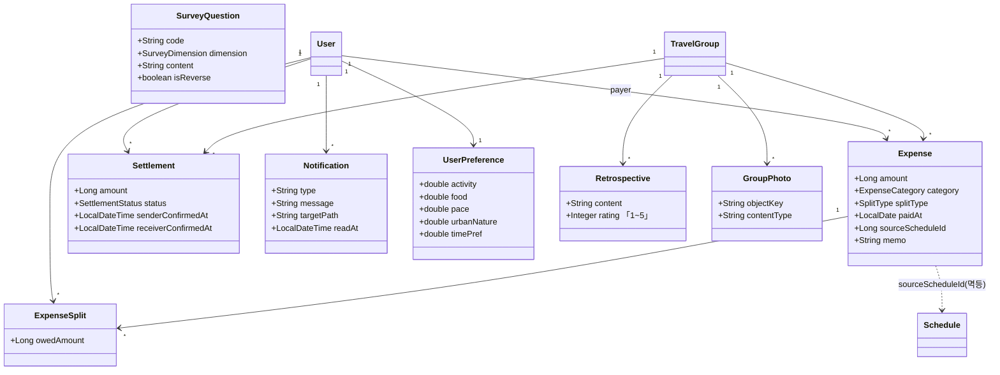
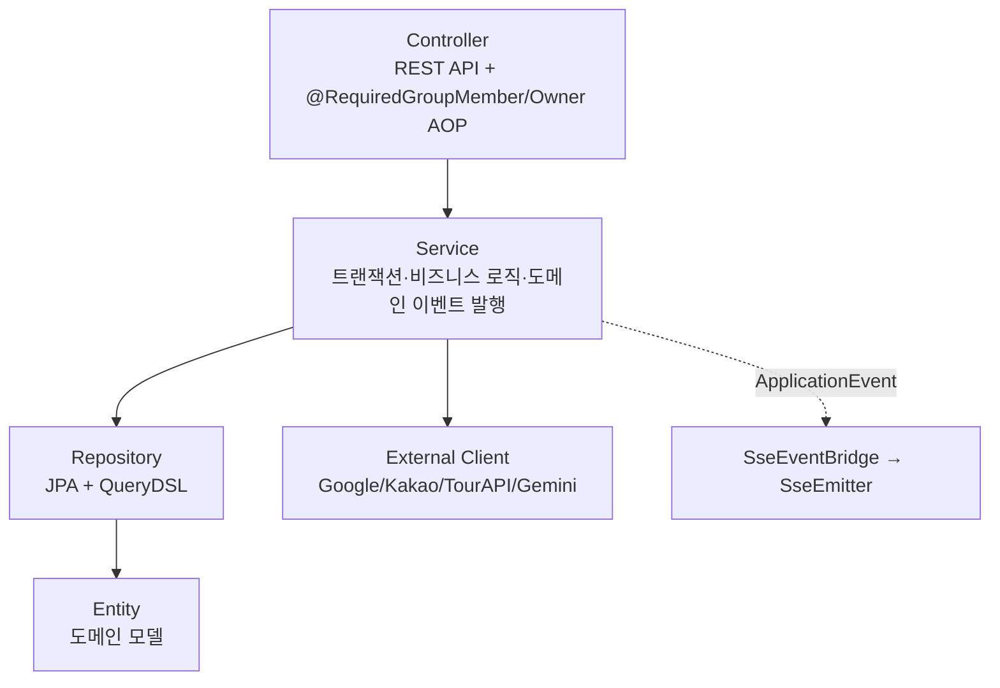

# 클래스 다이어그램 (도메인 모델)

**프로젝트명** 그룹 여행 협업 플랫폼 (enjoy-trip)
**기준** `backend/.../domain/*/entity` JPA 엔티티 + 공통 `BaseEntity`

> 모든 엔티티는 `created_at`/`updated_at`을 가지는 추상 `BaseEntity`를 상속한다(다이어그램에서는 생략).
> 연관은 JPA 매핑 + DB FK 기준이며, 일부는 성능상 ID 참조(FK만)로 둔 곳이 있다.

---

## 1. 핵심 도메인 — 사용자·그룹·멤버십

---

## 2. 콘텐츠 도메인 — 장소·일정·투표·숙소

---

## 3. 정산·알림·기타 도메인

---

## 4. 주요 열거형(Enum)

| Enum | 값 |
| --- | --- |
| `OAuthProvider` | GOOGLE, KAKAO |
| `GroupStatus` | PLANNING, IN_PROGRESS, COMPLETED, DELETED |
| `GroupRole` | OWNER, MEMBER |
| `ScheduleStatus` | PLANNED, VOTING, CANCELLED |
| `TransportMode` | CAR, TRANSIT, WALK |
| `VoteStatus` | OPEN, CLOSED |
| `ExpenseCategory` | MEAL, LODGING, TRANSPORT, TICKET, OTHER |
| `SplitType` | EQUAL, RATIO, AMOUNT |
| `SettlementStatus` | PENDING, SENT, COMPLETED |
| `BookingStatus` | SELECTED, BOOKED |
| `SurveyDimension` | ACTIVITY, FOOD, PACE, URBAN_NATURE, TIME_PREF |

---

## 5. 계층 구조 (레이어드 아키텍처)

