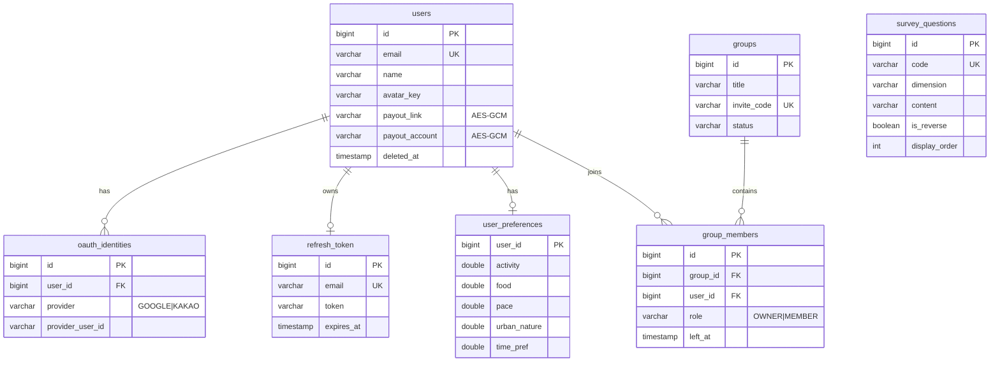
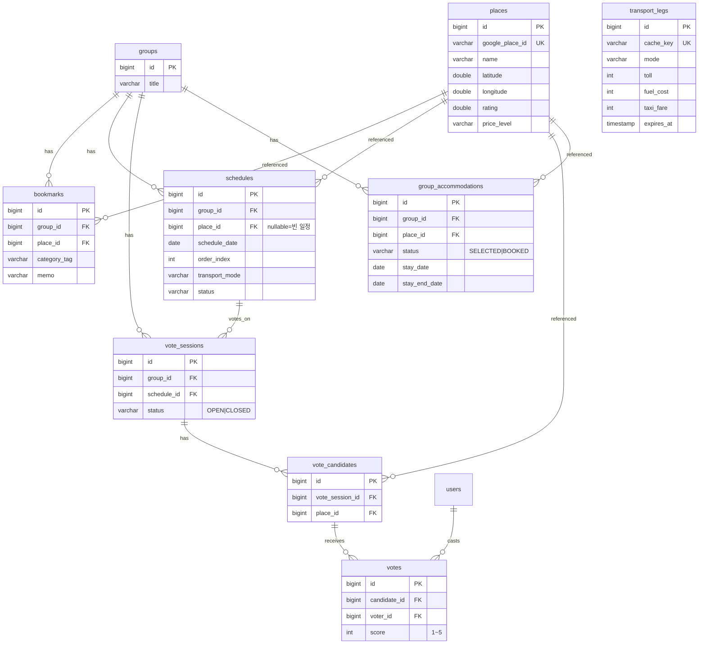
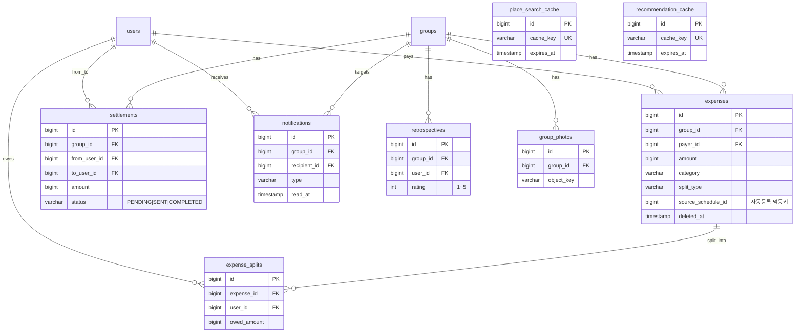

# ER 다이어그램

**프로젝트명** 그룹 여행 협업 플랫폼 (enjoy-trip)
**DBMS** PostgreSQL 16
**기준** Flyway 마이그레이션 `V2 ~ V29` 최종 상태 (DDL 원천: `backend/src/main/resources/db/migration/`)

> 표기: PK=기본키, FK=외래키, UK=유니크. 모든 테이블은 `created_at`/`updated_at` 공통 컬럼 보유.

---

## 1. 전체 ER 다이어그램

```mermaid
erDiagram
    users ||--o{ oauth_identities : has
    users ||--o| refresh_token : owns
    users ||--o| user_preferences : has
    users ||--o{ group_members : joins
    groups ||--o{ group_members : contains
    groups ||--o{ bookmarks : has
    groups ||--o{ schedules : has
    groups ||--o{ vote_sessions : has
    groups ||--o{ expenses : has
    groups ||--o{ settlements : has
    groups ||--o{ group_accommodations : has
    groups ||--o{ group_photos : has
    groups ||--o{ retrospectives : has
    groups ||--o{ notifications : targets

    places ||--o{ bookmarks : referenced
    places ||--o{ schedules : referenced
    places ||--o{ vote_candidates : referenced
    places ||--o{ group_accommodations : referenced

    schedules ||--o{ vote_sessions : votes_on
    vote_sessions ||--o{ vote_candidates : has
    vote_candidates ||--o{ votes : receives
    users ||--o{ votes : casts

    expenses ||--o{ expense_splits : split_into
    users ||--o{ expense_splits : owes
    users ||--o{ expenses : pays

    users {
        bigint id PK
        varchar email UK
        varchar name
        varchar avatar_key
        varchar payout_link "AES-GCM 암호문"
        varchar payout_account "AES-GCM 암호문"
        timestamp deleted_at
    }
    oauth_identities {
        bigint id PK
        bigint user_id FK
        varchar provider "GOOGLE|KAKAO"
        varchar provider_user_id
    }
    refresh_token {
        bigint id PK
        varchar email UK
        varchar token
        timestamp expires_at
    }
    survey_questions {
        bigint id PK
        varchar code UK
        varchar dimension
        varchar content
        boolean is_reverse
        int display_order
    }
    user_preferences {
        bigint user_id PK
        double activity
        double food
        double pace
        double urban_nature
        double time_pref
    }
    groups {
        bigint id PK
        varchar title
        varchar destination
        date start_date
        date end_date
        varchar invite_code UK
        varchar status "PLANNING|IN_PROGRESS|COMPLETED|DELETED"
        varchar cover_image_key
        varchar cover_object_key
        timestamp deleted_at
    }
    group_members {
        bigint id PK
        bigint group_id FK
        bigint user_id FK
        varchar role "OWNER|MEMBER"
        timestamp joined_at
        timestamp left_at
    }
    places {
        bigint id PK
        varchar google_place_id UK
        varchar name
        double latitude
        double longitude
        double rating
        varchar price_level
        varchar photo_name
    }
    bookmarks {
        bigint id PK
        bigint group_id FK
        bigint place_id FK
        bigint created_by FK
        varchar category_tag
        varchar memo
    }
    schedules {
        bigint id PK
        bigint group_id FK
        bigint place_id FK "nullable=빈 일정"
        date schedule_date
        int order_index
        time start_time
        time end_time
        varchar title
        bigint estimated_cost
        varchar transport_mode "CAR|TRANSIT|WALK"
        varchar status "PLANNED|VOTING|CANCELLED"
    }
    transport_legs {
        bigint id PK
        varchar cache_key UK
        varchar mode
        int duration_seconds
        int distance_meters
        int toll
        int fuel_cost
        int taxi_fare
        timestamp expires_at
    }
    vote_sessions {
        bigint id PK
        bigint group_id FK
        bigint schedule_id FK
        varchar status "OPEN|CLOSED"
        bigint winner_candidate_id
    }
    vote_candidates {
        bigint id PK
        bigint vote_session_id FK
        bigint place_id FK
        bigint registered_by FK
    }
    votes {
        bigint id PK
        bigint candidate_id FK
        bigint voter_id FK
        int score "1~5"
    }
    expenses {
        bigint id PK
        bigint group_id FK
        bigint payer_id FK
        bigint created_by FK
        bigint amount
        varchar category "MEAL|LODGING|TRANSPORT|TICKET|OTHER"
        varchar split_type "EQUAL|RATIO|AMOUNT"
        date paid_at
        bigint source_schedule_id "자동등록 멱등키"
        varchar memo
        timestamp deleted_at
    }
    expense_splits {
        bigint id PK
        bigint expense_id FK
        bigint user_id FK
        bigint owed_amount
    }
    settlements {
        bigint id PK
        bigint group_id FK
        bigint from_user_id FK
        bigint to_user_id FK
        bigint amount
        varchar status "PENDING|SENT|COMPLETED"
        timestamp sender_confirmed_at
        timestamp receiver_confirmed_at
    }
    group_accommodations {
        bigint id PK
        bigint group_id FK
        bigint place_id FK
        varchar status "SELECTED|BOOKED"
        bigint reservation_price
        date stay_date
        date stay_end_date
        varchar booking_photo_key
    }
    group_photos {
        bigint id PK
        bigint group_id FK
        bigint uploaded_by FK
        varchar object_key
        varchar content_type
    }
    retrospectives {
        bigint id PK
        bigint group_id FK
        bigint user_id FK
        varchar content
        int rating "1~5"
    }
    notifications {
        bigint id PK
        bigint group_id FK
        bigint recipient_id FK
        varchar type
        varchar message
        varchar target_path
        timestamp read_at
    }
    place_search_cache {
        bigint id PK
        varchar cache_key UK
        text result_json
        timestamp expires_at
    }
    recommendation_cache {
        bigint id PK
        varchar cache_key UK
        text result_json
        timestamp expires_at
    }
```

> 전체 ERD는 테이블이 많아 한 장에서는 글씨가 작다. 발표/문서용으로는 아래 **도메인별 분할 ERD**(1-A~1-C)를
> 쓰면 읽기 좋다. (PNG/SVG: `다이어그램/04_ER다이어그램_분할_*.png`, 전체 고해상도: `04_ER다이어그램.svg`)

---

### 1-A. 인증 · 계정 · 성향 설문

### 1-B. 콘텐츠 — 장소 · 일정 · 투표 · 숙소

### 1-C. 정산 · 알림 · 회고 · 갤러리 · 캐시

---

## 2. 테이블 요약 (23개)

| 도메인 | 테이블 |
| --- | --- |
| 인증/계정 | `users`, `oauth_identities`, `refresh_token` |
| 성향 설문 | `survey_questions`, `user_preferences` |
| 그룹 | `groups`, `group_members`, `group_photos` |
| 장소 | `places`, `bookmarks`, `place_search_cache` |
| 일정 | `schedules`, `transport_legs`, `group_accommodations` |
| 투표 | `vote_sessions`, `vote_candidates`, `votes` |
| 정산 | `expenses`, `expense_splits`, `settlements` |
| 추천/회고/알림 | `recommendation_cache`, `retrospectives`, `notifications` |

---

## 3. 주요 무결성 제약 / 인덱스

- **유니크**: `users.email`, `groups.invite_code`, `places.google_place_id`,
  `group_members(group_id,user_id)`, `votes(candidate_id,voter_id)`,
  `settlements(group_id,from_user_id,to_user_id)`, `retrospectives(group_id,user_id)`,
  `oauth_identities(provider,provider_user_id)`
- **CHECK**: 점수 1~5(`votes`, `retrospectives`), 금액 범위(`expenses` 1~1억), 상태 enum 값,
  기간(`groups.start_date ≤ end_date`), 성향 벡터 0.0~1.0
- **부분 인덱스**: `expenses(group_id, paid_at DESC) WHERE deleted_at IS NULL`,
  `notifications(recipient_id, read_at) WHERE read_at IS NULL`
- **Soft Delete**: `users.deleted_at`, `groups.deleted_at`, `expenses.deleted_at`
- **캐시 만료**: `place_search_cache`/`recommendation_cache`/`transport_legs`의 `expires_at`

> 마이그레이션 히스토리(요지): V2 초기 스키마 → V4 정산 → V6 알림 → V7 Part A(장소/일정/투표/추천/회고)
> → V9 OAuth 식별자 → V11 숙소 → V13 빈 일정 → V17 갤러리/아바타 → V21 이미지 객체스토리지 전환
> → V23/V25 숙박 기간 → V27/V29 정산 수취정보 + 컬럼 암호화 확장.
