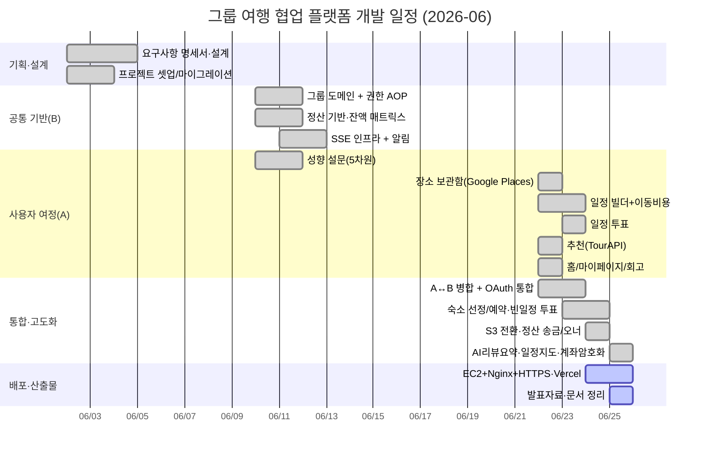

# WBS & 간트 차트

**프로젝트명** 그룹 여행 협업 플랫폼 (enjoy-trip)
**기간** 2026-06-02 ~ 2026-06-25 · **인원** 2명
**분담** 담당 A = 사용자 여정·콘텐츠(설문/장소/일정/투표/추천/홈/마이) · 담당 B = 기반·비용·인프라(그룹/정산/SSE/알림/권한 AOP)

---

## 1. WBS (Work Breakdown Structure)

```
1. 기획·설계
   1.1 요구사항 명세서 작성 (SRS v1.1)
   1.2 외부 인터페이스 전략 (Google/Kakao/TourAPI 책임 분리)
   1.3 ER·클래스·화면 설계
2. 공통 기반 (담당 B 중심)
   2.1 프로젝트 셋업 (Spring Boot 4 / React 19 / PostgreSQL / Flyway)
   2.2 인증·보안 (OAuth2, JWT, Security 필터, CORS)
   2.3 그룹 도메인 + 권한 AOP (@RequiredGroupMember/Owner)
   2.4 SSE 실시간 인프라 + 알림
3. 사용자 여정·콘텐츠 (담당 A 중심)
   3.1 성향 설문 (12문항 → 5차원 벡터, 그룹 페르소나)
   3.2 장소 보관함 (Google Places 단일소스 + 캐시)
   3.3 일정 빌더 (CRUD·드래그·카카오 모빌리티 이동비용·지도)
   3.4 일정 투표 (후보/투표/마감)
   3.5 추천 (TourAPI + 성향 코사인 정렬)
   3.6 홈 대시보드 + 마이페이지/회고
4. 비용 정산 (담당 B 중심)
   4.1 지출 등록/목록/수정 (균등·비율·금액 분담)
   4.2 정산 매트릭스 (최소 송금 Greedy)
   4.3 송금 딥링크 + 완료 처리
   4.4 이동/숙박비 자동 등록 연동
5. 통합·고도화
   5.1 A↔B 병합, OAuth 로그인 통합
   5.2 숙소 선정/예약, 빈 일정+투표 결정
   5.3 이미지 객체 스토리지(S3) 전환
   5.4 AI 리뷰 요약, 일정 지도, 계좌 암호화
6. 배포·산출물
   6.1 EC2 + Docker + Nginx + HTTPS, Vercel 프론트
   6.2 발표자료·시연·문서 정리
```

---

## 2. 간트 차트



---

## 3. 마일스톤

| 마일스톤 | 일자 | 비고 |
| --- | --- | --- |
| M0 프로젝트 착수·마이그레이션 | 06-02 | 패키지 `com.enjoytrip` 초기화 |
| M1 공통 기반(그룹/정산/SSE) | 06-11 | 권한 AOP·잔액 매트릭스·실시간 인프라 |
| M2 핵심 도메인 완성·1차 통합 | 06-22 | 설문·장소·일정·투표·추천·홈·마이 + OAuth |
| M3 협업 시나리오 고도화 | 06-23 | 숙소·빈 일정 투표·정산 배선 |
| M4 운영 품질·부가기능 | 06-25 | S3·AI 요약·일정 지도·계좌 암호화 |
| M5 배포·발표 | 06-24~25 | HTTPS 전환·시연·산출물 |

---

## 4. 개인별 일정(요약)

| 주차 | 담당 A | 담당 B |
| --- | --- | --- |
| 1주차 | 설문·요구사항·설계 | 셋업·그룹·정산 기반·SSE |
| 2주차 | 장소·일정·투표·추천·홈/마이 + 통합 | 정산 송금/완료·알림·OAuth·인프라 + 통합 |
| 마감 | 일정 지도·AI 요약·문서 | S3·계좌 암호화·배포(HTTPS) |

> 실제 커밋 이력(`git log`) 기준으로 작성. 1주차 후반은 개인 일정으로 커밋 공백 후 06-22 집중 통합.
