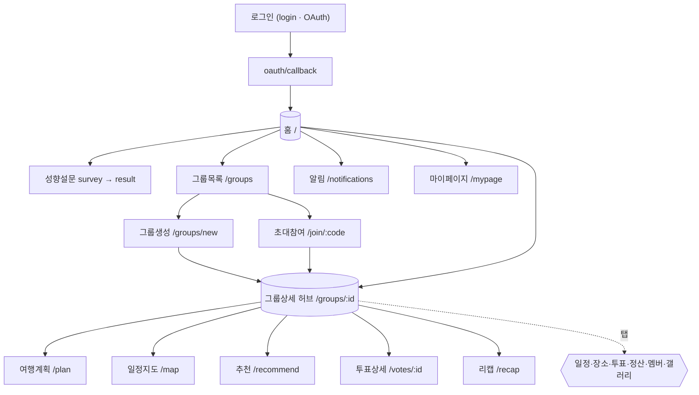

# 화면 설계서

**프로젝트명** 그룹 여행 협업 플랫폼 (enjoy-trip)
**플랫폼** 모바일 우선 반응형 웹 (React 19 + TypeScript + Tailwind)
**디자인 토큰** Primary `#FF9F66` · Background `#FFF8F0` · 카드 radius 12px · 버튼 8px · 간격 4의 배수

---

## 1. 페이지 목록 (라우트 기준)

| 경로 | 페이지 | 인증 | 핵심 기능 |
| --- | --- | --- | --- |
| `/login` | 로그인 | X | Google/Kakao 소셜 로그인 |
| `/oauth/callback` | OAuth 콜백 | X | 1회용 코드 교환 → 토큰 발급 |
| `/` | 홈(대시보드) | O | 진행중/예정/완료 그룹, 알림 집계 |
| `/survey` | 성향 설문 | O | 12문항 5점 척도 |
| `/survey/result` | 설문 결과 | O | 레이더 차트 + 성향 설명 |
| `/groups` | 그룹 목록 | O | 상태별 탭 + D-day |
| `/groups/new` | 그룹 생성 | O | 제목·목적지·기간·커버 |
| `/join/:code` | 초대 코드 참여 | O | 코드 검증 → 가입 |
| `/groups/:id` | 그룹 상세(탭 허브) | O+멤버 | 일정·장소·투표·정산·멤버·갤러리 탭 |
| `/groups/:id/plan` | 여행 계획 시작 | O+멤버 | 숙소 선정/예약·맛집·추천 플로우 |
| `/groups/:id/map` | 일정 지도 | O+멤버 | 일자별 핀 + 이동 경로 + 종합 이동 |
| `/groups/:id/recommend` | 성향 추천 | O+멤버 | TourAPI + 코사인 정렬 |
| `/groups/:id/votes/:voteId` | 투표 상세 | O+멤버 | 후보·점수·결과 막대 |
| `/groups/:id/recap` | 여행 리캡 | O+멤버 | 종료 그룹 요약·회고 |
| `/mypage` | 마이페이지 | O | 프로필·성향·계정·회고·수취정보 |
| `/notifications` | 알림함 | O | 알림 목록·읽음 처리 |

> 그룹 상세(`/groups/:id`)는 SPA 내부 탭(일정/장소/투표/정산/멤버/갤러리)으로 구성되며,
> 정산·지출 모달(`ExpenseFormModal`, `SettlementPanel`), 일정 추가 모달, 장소 선택 모달이 결합된다.

---

## 2. 화면 흐름도 (Site Map / Flow)



---

## 3. 주요 화면 와이어프레임 (텍스트 목업)

### 3.1 홈 (`/`)

```
┌─────────────────────────────┐
│  안녕하세요, OOO님 👋         │  ← 인사말
│  ┌───────────────────────┐  │
│  │ [진행중] 제주도 여행 D-2 │  │  ← 진행중 그룹(큰 카드)
│  └───────────────────────┘  │
│  예정된 여행  ▸▸ (가로 스크롤) │
│  [부산] [강릉] [경주] ...     │
│  ─────────────────────────  │
│  🔔 미정산 32,000원 · 투표 1건 │  ← 알림 집계
├─────────────────────────────┤
│ [홈] [그룹] [추천] [알림] [MY]│  ← 하단 탭바
└─────────────────────────────┘
```

### 3.2 그룹 상세 허브 (`/groups/:id`)

```
┌─────────────────────────────┐
│ ← 제주도 여행   D-2  [초대]    │  ← 커버·D-day·초대코드 복사
│ [일정][장소][투표][정산][멤버] │  ← 탭
│ ─────────────────────────── │
│ 1일차  06.28                 │
│  ① 09:00 고기리막국수         │
│  └─🚗 48분·30.4km            │  ← 이동 정보 카드
│  ② 11:00 황소고집 본점         │
│  🏨 숙소·아스트로호텔          │
│ + 일정 추가                   │
└─────────────────────────────┘
```

### 3.3 정산 (`/groups/:id` 정산 탭)

```
┌─────────────────────────────┐
│ 총 지출 240,000원 · 1인 60,000│
│ [도넛: 식비/숙박/교통/기타]    │
│ ── 정산 매트릭스 ──           │
│  A → B   30,000원 [토스][완료] │  ← 최소 송금 + 딥링크
│  C → A   15,000원 [카페][완료] │
│ + 지출 등록                   │
└─────────────────────────────┘
```

### 3.4 성향 설문 결과 (`/survey/result`)

```
┌─────────────────────────────┐
│        [ 레이더 차트 ]        │  ← 5차원 벡터(recharts)
│   액티비티 ●─────○ 휴식        │
│   당신은 액티비티 80% 형 여행자 │
│         [ 재설문하기 ]        │
└─────────────────────────────┘
```

---

## 4. 공통 컴포넌트

| 컴포넌트 | 변형 |
| --- | --- |
| Button | Primary / Secondary / Danger / Ghost |
| Modal | Confirm / Form (지출·일정·장소) |
| Toast | Success / Error / Info / Warning (SSE 닉네임 알림 포함) |
| Skeleton | List / Card (로딩) |
| EmptyState | 그룹/장소/일정/지출/검색 빈 상태 |
| AppLayout | 상단 타이틀·뒤로가기 + 하단 탭바 |
| RadarChart | 성향 5차원 시각화 |

---

## 5. 반응형 브레이크포인트

| 구분 | 너비 | 레이아웃 |
| --- | --- | --- |
| Mobile | ~767px | 1열 (기본) |
| Tablet | 768~1023px | 2열 |
| Desktop | 1024px~ | 중앙 정렬 모바일 폭 또는 다열 |

> 디자인 원칙: 모바일 우선(최소 320px), 모든 액션 키보드 접근, 로딩 스켈레톤, 즉시 토스트 피드백.
