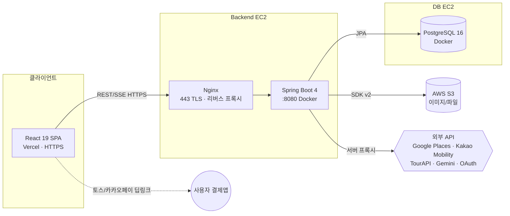
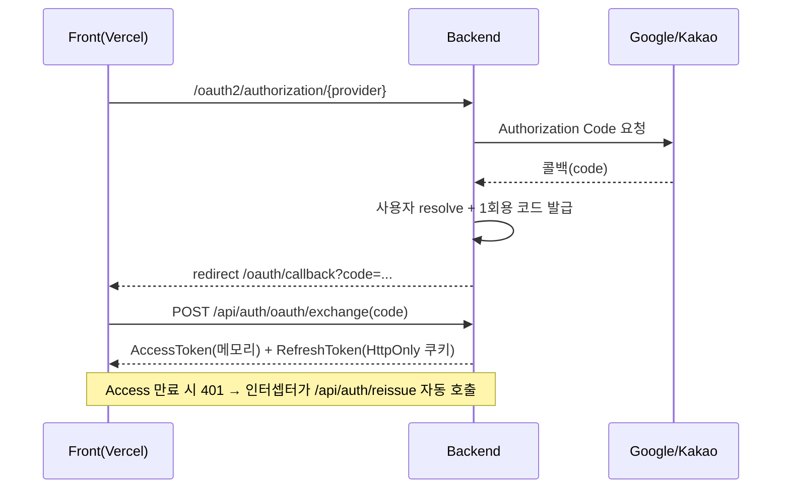
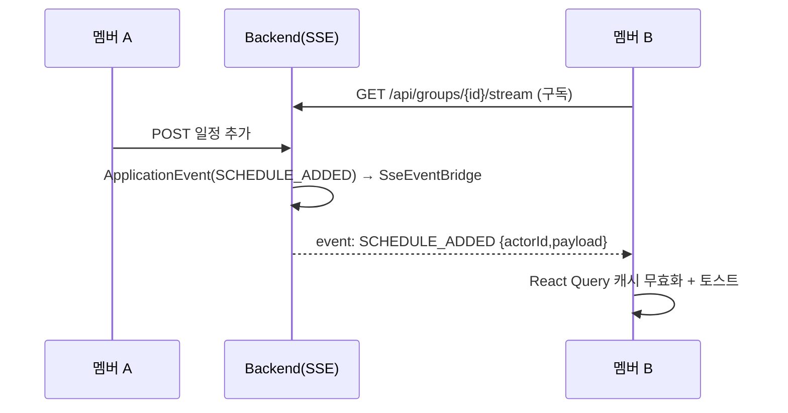

# 기타 참고 문서 — API 명세 & 시스템 구조

**프로젝트명** 그룹 여행 협업 플랫폼 (enjoy-trip)

---

## 1. 시스템 아키텍처

- **프론트엔드**: Vercel(HTTPS) 정적 호스팅. axios 인터셉터가 401 시 토큰 자동 재발급.
- **백엔드**: EC2 위 Docker(Spring Boot :8080). Nginx가 443 TLS 종단 후 리버스 프록시.
- **DB**: 별도 EC2의 PostgreSQL(Docker). 스키마는 Flyway로 버전 관리.
- **스토리지**: 이미지/예약사진/아바타/커버를 AWS S3(SDK v2)에 object key로 저장.
- **외부 API**: 키는 백엔드 환경 변수 전용. 응답은 DB 캐시(검색24h/상세7d/경로1h/추천24h).

---

## 2. 기술 스택

| 구분 | 기술 |
| --- | --- |
| Backend | Spring Boot **4.0.6**, JDK 21, Gradle |
| Persistence | Spring Data JPA + **QueryDSL 5.1**, PostgreSQL 16, **Flyway** |
| Security | Spring Security 6, OAuth2 Client(Google/Kakao), **JWT(jjwt 0.12.6)** |
| Storage | AWS SDK v2 (S3) |
| API Docs | springdoc-openapi (Swagger UI) |
| Crypto | AES-GCM 컬럼 암호화(정산 계좌) |
| Frontend | React 19, TypeScript 6, Vite 8, Tailwind 4 |
| State/Data | Zustand 5(인증 메모리), **TanStack Query 5**(서버 상태) |
| Realtime | SSE(`@microsoft/fetch-event-source`) |
| Charts/Map | recharts, Kakao Maps JS SDK |
| Infra | Docker Compose, Nginx, Let's Encrypt, EC2, Vercel |

---

## 3. REST API 명세 (도메인별 주요 엔드포인트)

> 공통 응답: `ApiResponse<T> { success, message, data }`. 그룹 스코프는 멤버/Owner 권한 검증.

### 인증/계정
| Method | Path | 설명 |
| --- | --- | --- |
| POST | `/api/auth/oauth/exchange` | 1회용 코드 → 토큰 교환 |
| POST | `/api/auth/reissue` | Access Token 재발급(Refresh 쿠키) |
| POST | `/api/auth/logout` | 로그아웃 |
| GET/PATCH | `/api/users/me/payout` | 정산 수취정보 조회/수정(암호화) |
| POST/GET | `/api/users/me/avatar`, `/api/users/{id}/avatar` | 아바타 업로드/조회 |

### 성향 설문
| Method | Path | 설명 |
| --- | --- | --- |
| GET | `/api/surveys/questions` | 문항 목록 |
| POST | `/api/surveys/submit` | 응답 제출 → 5차원 벡터 |
| GET | `/api/surveys/me` | 내 성향 |
| GET | `/api/groups/{groupId}/persona` | 그룹 페르소나 매칭 |

### 그룹
| Method | Path | 설명 |
| --- | --- | --- |
| POST | `/api/groups` / `GET /api/groups` | 생성 / 내 그룹 목록 |
| POST | `/api/groups/join/{inviteCode}` | 초대 코드 참여 |
| GET/PATCH | `/api/groups/{groupId}` | 상세 / 수정(Owner) |
| GET/POST | `/api/groups/{groupId}/cover` | 커버 조회/업로드 |
| GET | `/api/groups/{groupId}/members` | 멤버 목록 |
| DELETE | `/api/groups/{groupId}/members/me` `/{targetUserId}` | 떠나기 / 강퇴(Owner) |
| PATCH | `/api/groups/{groupId}/owner/{targetUserId}` | Owner 위임 |
| DELETE | `/api/groups/{groupId}` | 해체(Owner) |
| PATCH | `/api/groups/{groupId}/invite-code` | 초대 코드 재발급(Owner) |

### 장소/일정/투표/숙소
| Method | Path | 설명 |
| --- | --- | --- |
| GET | `/api/groups/{groupId}/places/search` | Google Places 검색(캐시) |
| GET | `/api/groups/{groupId}/places/{googlePlaceId}/review-summary` | 리뷰 AI 요약 |
| GET/POST/PATCH/DELETE | `/api/groups/{groupId}/places` `/{bookmarkId}` | 보관함 CRUD |
| GET/POST/PATCH/DELETE | `/api/groups/{groupId}/schedules` `/{scheduleId}` | 일정 CRUD |
| PATCH | `/api/groups/{groupId}/schedules/reorder` | 순서 변경 |
| PATCH | `/api/groups/{groupId}/schedules/{id}/cost` `/place` | 예상비용/장소 변경 |
| GET | `/api/groups/{groupId}/schedules/transport` `/transport-path` | 이동 비용/경로 |
| POST | `/api/groups/{groupId}/schedules/transport-expense` | 이동비 정산 자동등록 |
| GET/POST | `/api/groups/{groupId}/accommodations` | 숙소 선정 |
| POST/GET | `/api/groups/{groupId}/accommodations/{id}/booking` `/photo` | 예약 정보/사진 |
| POST/GET | `/api/groups/{groupId}/schedules/{id}/vote-sessions` | 투표 세션 생성/조회 |
| POST | `.../vote-sessions/{sessionId}/candidates` `/votes` `/close` | 후보/투표/마감 |

### 정산/알림/추천/홈/마이/SSE
| Method | Path | 설명 |
| --- | --- | --- |
| GET/POST/PATCH/DELETE | `/api/groups/{groupId}/expenses` `/{expenseId}` | 지출 CRUD |
| GET | `/api/groups/{groupId}/expenses/summary` | 지출 요약 차트 |
| GET | `/api/groups/{groupId}/settlements` `/progress` | 정산 매트릭스/진행률 |
| GET | `/api/groups/{groupId}/settlements/{id}/payment-links` | 토스/카카오페이 딥링크 |
| PATCH | `.../settlements/{id}/sent` `/complete` | 송금/완료 확인 |
| GET/PATCH | `/api/notifications` `/{id}/read` `/read-all` `/unread-count` | 알림함 |
| GET | `/api/groups/{groupId}/recommendations` | 성향 기반 추천 |
| GET | `/api/home`, `/api/mypage/stats`, `/api/mypage/retrospectives` | 홈/마이 집계 |
| GET | `/api/groups/{groupId}/stream` | SSE 실시간 이벤트 |

---

## 4. 인증·실시간 시퀀스

### 4.1 OAuth 로그인 + 토큰 재발급

### 4.2 SSE 실시간 동기화

---

## 5. 외부 API 캐시·비용 정책

| API | 캐시 | 위치 |
| --- | --- | --- |
| Google Places 검색 | 24시간 | `place_search_cache` |
| Google Place Details | 7일 | DB |
| 카카오 모빌리티 경로 | 1시간 | `transport_legs` |
| TourAPI 추천 | 24시간 | `recommendation_cache` |

> 비용 폭주 방지 원칙: 모든 외부 API는 BE 캐시 필수, 필드마스크 명시, 키는 BE 전용.
